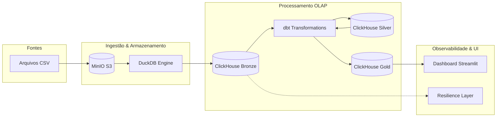

# 📊 Northwind Modern Data Pipeline

[](#)
[](#)

## 6.1 Objeto do Projeto
Este projeto aborda a modernização do processamento de dados de vendas da Northwind, transformando um sistema legado de arquivos dispersos em uma infraestrutura analítica de alta performance. O objetivo é fornecer aos analistas de negócio uma visão consolidada e em tempo real do faturamento e performance de produtos, eliminando a latência de relatórios manuais e garantindo a integridade dos dados através de uma arquitetura resiliente. O dataset utilizado contempla o histórico de pedidos, produtos e detalhes de transações da Northwind.

## 6.2 Arquitetura Adotada
A arquitetura segue o padrão **Medallion** (Bronze, Silver, Gold), priorizando desacoplamento e performance analítica.



### Componentes e Decisões Arquiteturais:
*   **MinIO (S3-Compatible):** Armazenamento durável de objetos, garantindo a **Tática de Redundância de Dados (Bass)** para recuperação de desastres.
*   **DuckDB:** Motor de processamento em memória para ingestão ultra-rápida de CSVs para JSON, reduzindo o tempo de CPU (Eficiência de Performance).
*   **ClickHouse:** Banco de dados orientado a colunas (OLAP), otimizado para agregações massivas em milissegundos.
*   **dbt (data build tool):** Orquestra transformações SQL modulares, seguindo a **Tática de Separação de Responsabilidades**.
*   **Tenacity & Heartbeats:** Camada de resiliência que implementa **Retentativas com Backoff Exponencial (Bass)** para mitigar falhas transitórias de rede.
*   **Streamlit:** Interface visual para entrega de valor imediato ao negócio com baixa latência de desenvolvimento.

## 🚀 Como Executar

### 1. Subir a Infraestrutura
Certifique-se de ter o Docker e Docker Compose instalados e execute:
```bash
docker-compose up -d --build
```

### 2. Configurar o Ambiente e Ingestão
Execute o script de setup automático dentro do container da aplicação:
```bash
docker exec -it app-northwind ./setup.sh
```
Este comando irá:
- Criar os buckets no MinIO e subir os CSVs originais.
- Criar a tabela `ingestion` (Bronze) no ClickHouse.
- Executar a ingestão dos dados brutos em formato JSON via DuckDB.
- Rodar as transformações dbt (Silver e Gold).

### 3. Acessar o Dashboard
O dashboard Streamlit estará disponível em:
👉 [http://localhost:8501](http://localhost:8501)

## 6.4 Como verificar o funcionamento adequado?

### Validação por Testes
Execute a suite de testes automatizados (Unitários e Integração):
```bash
PYTHONPATH=. pytest tests/
```

### Validação de Dados (Queries SQL)
Acesse o cliente do ClickHouse e valide a camada Gold:
```sql
-- Verificar total de vendas processadas
SELECT count(), sum(line_total_price) FROM northwind.fct_sales;
```

### Observabilidade em Tempo Real
Os logs são emitidos em formato JSON estruturado. Exemplo de log de saúde (Heartbeat):
`{"timestamp": "2026-05-31 20:22:15", "level": "INFO", "message": "ClickHouse Heartbeat: OK"}`

## 6.5 Quais foram os aprendizados obtidos?

### Trade-offs e Decisões
*   **JSON vs Esquema Rígido na Bronze:** Optamos por salvar os dados brutos como String (JSON) na camada Bronze para garantir resiliência contra mudanças súbitas no esquema de origem (Schema-on-read). Isso aumenta a flexibilidade em troca de um custo computacional extra no dbt.
*   **DuckDB vs Ingestão Nativa:** O uso do DuckDB permitiu realizar o parse de CSVs complexos em memória antes de enviar ao ClickHouse, reduzindo a carga de escrita no banco OLAP.

### Dívida Técnica e Melhorias Futuras
*   **Segurança:** Em ambiente produtivo, o acesso ao ClickHouse e MinIO deve ser restringido via políticas de IAM e segredos gerenciados (ex: AWS Secrets Manager), ao contrário das variáveis `.env` locais.
*   **Escalabilidade:** Para volumes de dados em escala de Petabytes, a orquestração deveria ser migrada do Docker Compose para Kubernetes (K8s) com o uso de `ClickHouse Operator`.
*   **Monitoramento:** Integração nativa com Prometheus/Grafana para alertas de SLIs de latência de ingestão.

---
*Este projeto foi desenvolvido seguindo as diretrizes de SRE e Cloud para a modernização de pipelines analíticos.*
